# 💻 Yazılım Ajansı — ASP.NET Core 9 Web API & MVC


---

## 📖 Proje Hakkında

**Yazılım Ajansı**, bir dijital ajansın hem son kullanıcıya hitap eden tanıtım sitesini hem de içeriklerin dinamik olarak yönetildiği bir **Admin Panelini** kapsayan tam kapsamlı bir web projesidir.


- **`QuickStart.WebApiLayer`** → Tüm veri yönetimini üstlenen RESTful API katmanı
- **`QuickStartProject.WebUILayer`** → API'yi tüketen; hem ziyaretçilere hem de site yöneticilerine hitap eden MVC katmanı

Anasayfadaki tüm içerikler (hizmetler, fiyatlandırma, referanslar, SSS vb.) Admin Panelinden yapılan değişikliklerle **anlık olarak** güncellenir.

---

## 🏗️ Mimari ve Teknik Seçimler

| Kategori | Teknoloji | Açıklama |
|---|---|---|
| **Framework** | ASP.NET Core 9 | web API & MVC |
| **Veritabanı** | Microsoft SQL Server | İlişkisel veri yönetimi |
| **ORM** | Entity Framework Core 9 | Code-First modelleme |
| **API Dokümantasyonu** | Scalar (Mars Teması) | Modern API test arayüzü |
| **Güvenlik (UI)** | Cookie Authentication | Admin panel oturum yönetimi |
| **Veri Aktarımı** | DTO Pattern | Entity'den bağımsız güvenli veri taşıma |
| **API Haberleşmesi** | IHttpClientFactory | UI → API veri tüketimi |
| **Frontend** | Bootstrap 5, AOS, Swiper.js | Modern & responsive arayüz |

---

## ✨ Öne Çıkan Özellikler

### 📡 API Katmanı (WebApiLayer)
- **10 RESTful Controller** → Tüm varlıklar için tam CRUD endpoint'leri
- **Scalar Entegrasyonu** → Mars temasıyla şık ve interaktif API dokümantasyonu
- **EF Core Code-First** → Migration tabanlı veritabanı yönetimi
- **PrimitiveCollection Desteği** → `About.Images` ve `Pricing.Features` JSON array olarak saklanır

### 💻 MVC & Admin Paneli (WebUILayer)
- **12 Admin Controller** → About, Services, Features, FAQ, Pricing, Testimonials ve daha fazlası
- **ViewComponent Mimarisi** → Anasayfanın Her bölümü (Hero, Pricing, FAQ vs.) bağımsız bileşenler
- **Sleek Admin Tasarımı** → Koyu sidebar, gradient butonlar ve kart gölgeleri ile premium görünüm
- **İletişim & Bülten** → Ziyaretçi mesajları ve bülten abonelikleri admin panelinden yönetilir

---

## 📂 Proje Yapısı

```
QuickStart1/
├── QuickStart.WebApiLayer/
│   ├── Controller/            # 10 API Controller
│   ├── Entities/              # Veritabanı Entity'leri
│   ├── Contexts/              # EF Core DbContext
│   ├── DTOs/                  # Veri Transfer Nesneleri
│   └── Migrations/            # EF Core migration dosyaları
│
└── QuickStartProject.WebUILayer/
    ├── Areas/Admin/           # Admin Paneli (12 Controller + Views)
    ├── ViewComponents/        # Anasayfa bileşenleri
    ├── Views/Home/            # Anasayfa (Index.cshtml - 11 ViewComponent)
    ├── DTOs/                  # UI Katmanı DTO'ları
    └── wwwroot/               # Statik dosyalar (QuickStart & Mantis temaları)
```

---


## 📸 Ekran Görüntüleri

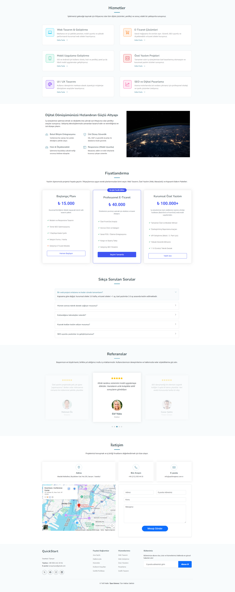

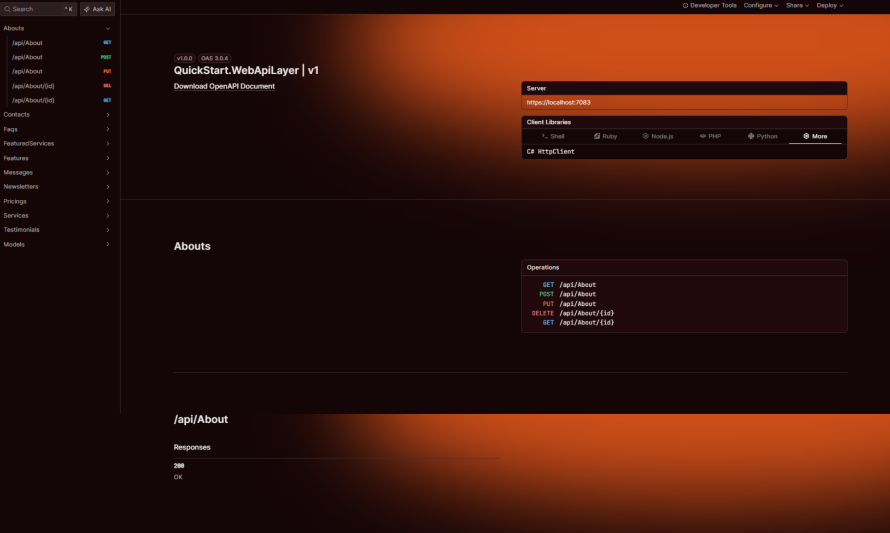


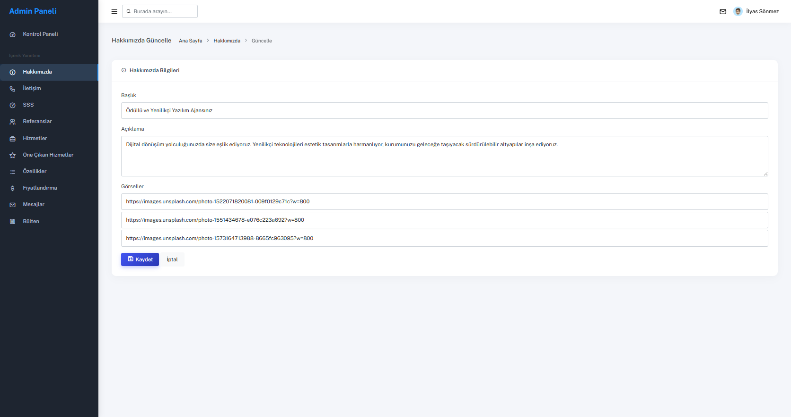

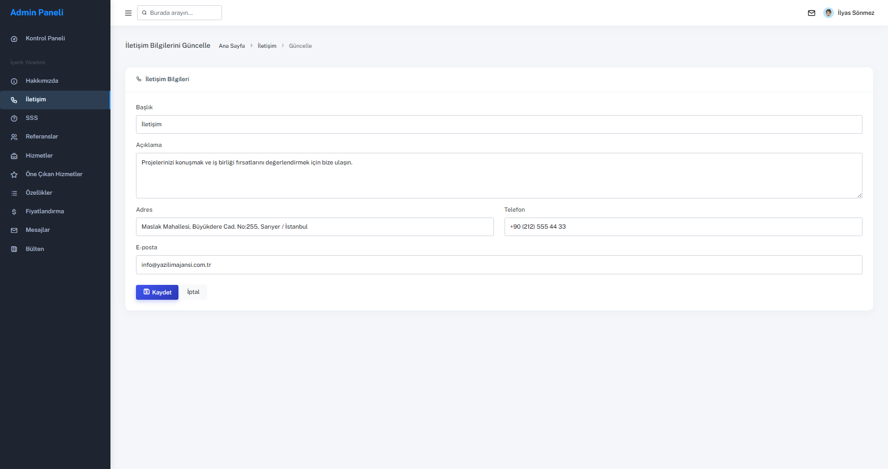

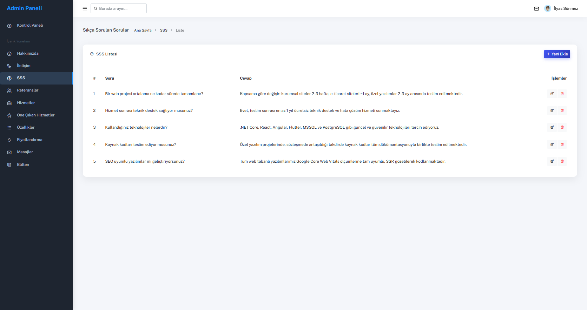

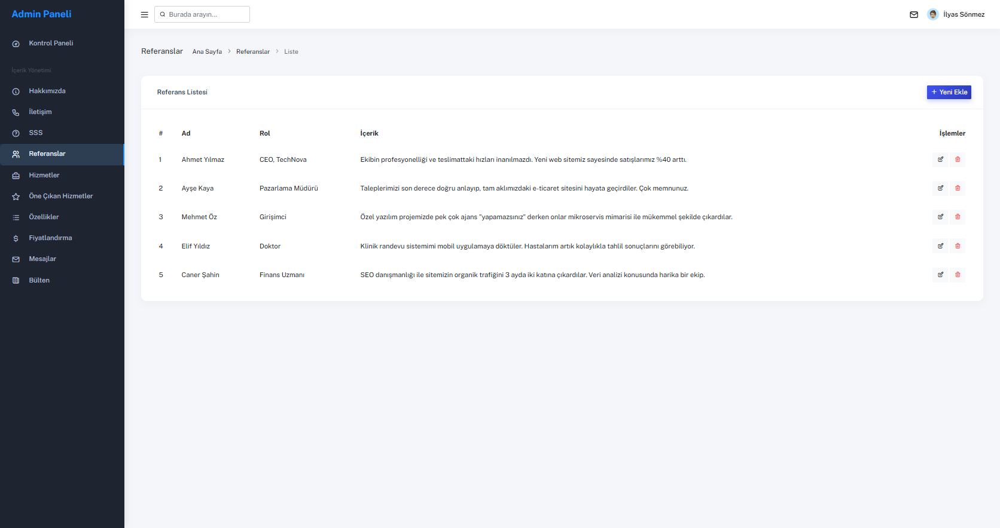

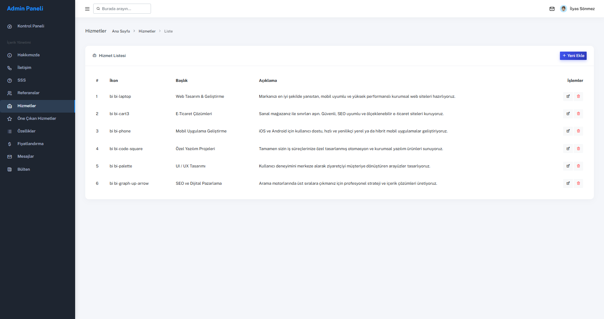

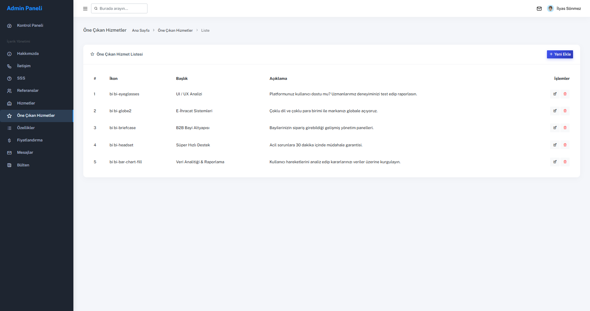

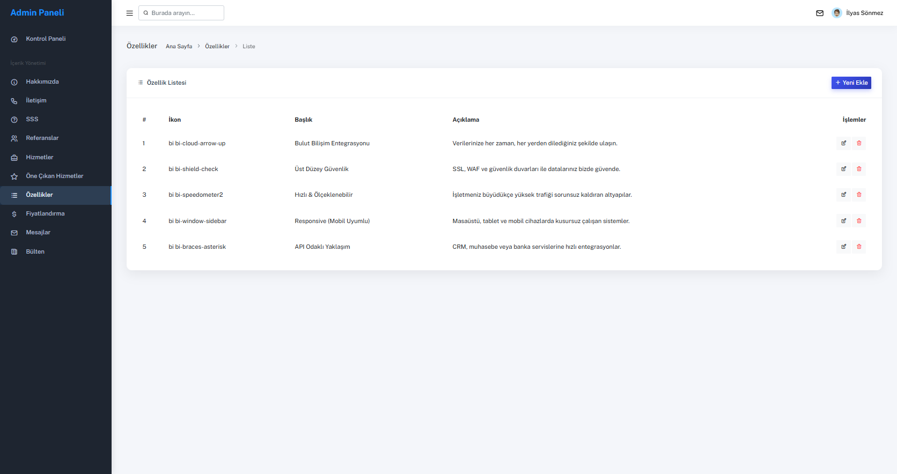

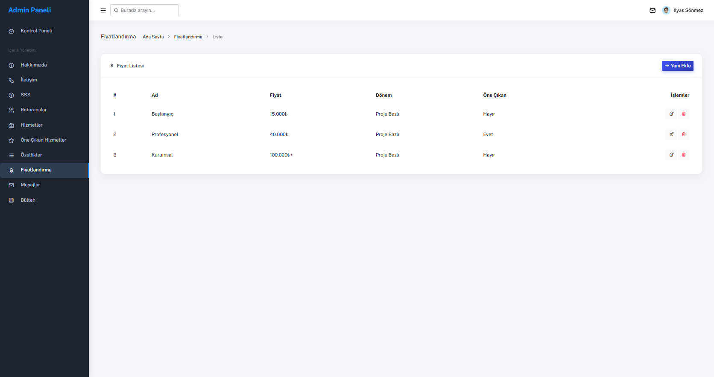

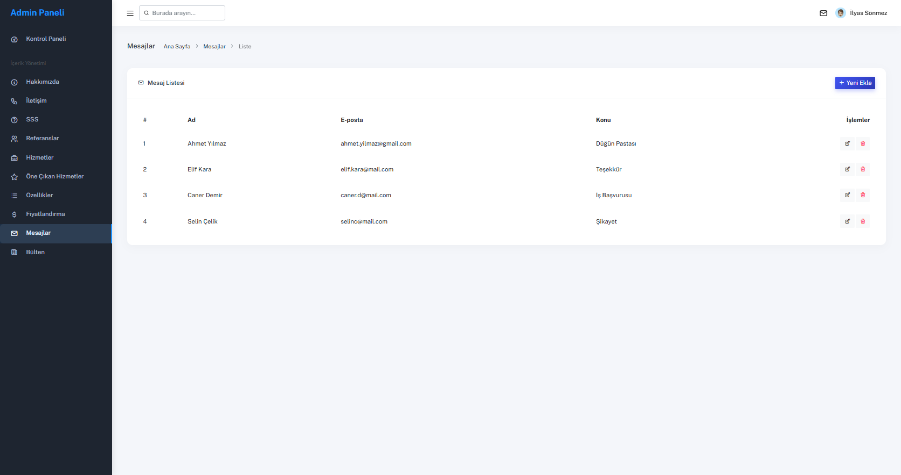

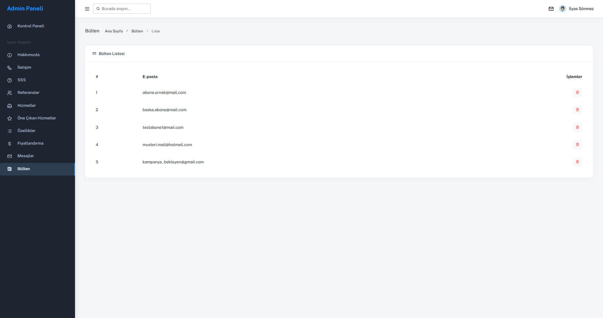